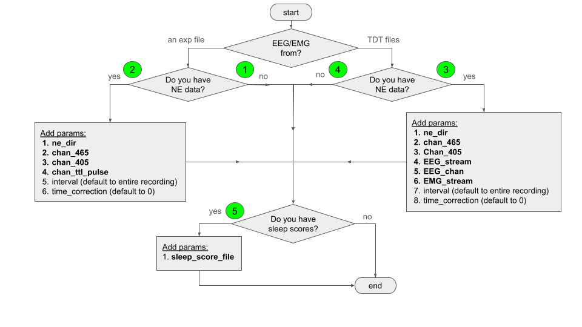

## preprocess_sleep_data

#### Usage example
First, make sure you "import" the preprocess_sleep_data folder and its helper, the EEGtoolbox folder, if the preprocess_sleep_data folder is not in your current directory. You could use absolute path in addpath. For example, 
```matlab
addpath('C:\Users\yzhao\matlab_projects\preprocess_sleep_data')
addpath('C:\Users\yzhao\matlab_projects\preprocess_sleep_data\EEGtoolbox')
```

After you have taken care of the "import", you can call the function like this 
```matlab
preprocess_sleep_data(...
    'C:\Users\yzhao\matlab_projects\sleep_data_extraction\Day 3 sleepscore', ...
    'fp_dir', 'C:\Users\yzhao\matlab_projects\sleep_data_extraction\Day 3 sleepscore', ...
    'EEG_stream', 'EEGw', ...
    'EEG_chan', 1, ...
    'EMG_stream', 'EMG1', ...
    'chan_465', 'x465A', ...
    'chan_405', 'x405A', ...
    'interval', (1000:11000), ...
    'time_correction', 0, ...
    'show_figure', true, ...
    'save_path', 'C:\Users\yzhao\matlab_projects\sleep_data_extraction\Klaudia_709_Day3_app.mat' ...
);

```

The first argument is the path to your EEG/EMG data. If your EEG/EMG data was recorded with an .exp file,  then this should be the path to the .exp file here. If your EEG/EMG data was recorded using TDT system, then shis should be the **directory** of the TDT files here.

The rest of the arguments are name-value pairs. You may need to provide them depending on your data. See the flowchart on the next page if you are not sure what arguments you need.


#### Output
The following fields are saved in the .mat file
1. eeg
2. emg
3. ne
4. sleep_scores 
5. num_class (fixed to be 3 for now)
6. eeg_frequency 
7. ne_frequency

#### Note
1. *ne* is downsampled by a factor of 100 before being saved.
2. eeg, emg, and ne are 1D arrays.
3. Make sure that you only fp_dir only contains one set of TDT files. 